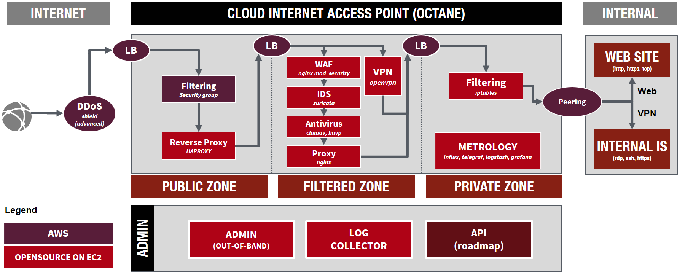

# AWS cIAP OCTANE

## What is OCTANE ?

**OCTANE** is:

* A cIAP (**c**loud **I**nternet **A**ccess **P**oint). Mainly, it is a **security product** between Internet and your public application hosted in your private zone
* The acronym (with imagination and goodwill) of **Opensource cIAP Nextgen**
* A Societe Generale Open Source project developped by [Eric BOUTEVILLE](https://github.com/qrn77) within **Public Cloud Feature Team (Cloud Center Of Excellence)** of **Societe Generale**
* Compatible on AWS but **can be modified to use another Cloud Service Provider (Azure, OpenStack, Vmware...)** or **bare-metal**, most of components are Linux-based softwares

## Why OCTANE ?

**OCTANE** can: 

* **Securly expose** a WebSite to Internet
* Protect you against **intrusions** (SQL injection, cross-site scripting (XSS), file inclusion...) & **virus**
* Limit you against **deny of service**
* Detect **malicious activities** or **policy violations**
* Securly **connect your external users** to your internal zone
* Collect **all the logs** and provide **metrics, search and analytics**
* Be **easly derivated on other x86** (Azure, OpenStack, Bare-Metal) platform in order to have **the same Internet Access Point in a multi-cloud context** 

## How (Architecture) ?

There are several layers (from the most exposed -Internet- to the less exposed -Internal-):

* redundant load-balancers
* redundant filtering layer
* redundant reverse-proxies
* redundant proxies with SSL terminaison
* redundant WAF or TCP relay (it depends on the protocol used)
* redundant Antivirus & IDS
* (not yet redundant) VPN
* redundant firewalls
* AWS private link or VPC peering (what suits you)

Those functionnalities are deployed by:
* The **cloudformation template** aims to build the AWS infrastructure (EC2, ELB...)
* The **ansible playbook** will configure all software components (inside EC2)

For further details, a more complete READme is available in each directory.

## Detailed documentation

### Architecture

* [Detailled architecture](documentation/architecture.md)
* [Ansible](ansible/READme.md)
* [CloudFormation](cloudformation/README.md)

### Run & Installation

* [Run book](documentation/run.md)
* [Installation guide](documentation/install.md)

## Roadmap

* Azure version
* Autoscaling group implementation
* Common referential (LDAP/other), this will permit to link users to domains/VPN.
* API to manage web exposition
* WEB server choice: apache/nginx 
* IDS choice: suricata/snort
* VPN choice: ipsec(strongswam)/wireguard/openvpn
* OpenStack version (idea)

## License

[GPLv2](https://www.gnu.org/licenses/old-licenses/gpl-2.0.en.html)

## Authors

This project has been created in 2018 by [Eric BOUTEVILLE](https://github.com/qrn77) and Product Owner by [Yannick NEFF](https://github.com/yannickneff)

## Contributors

* [Anthony GEA](https://www.linkedin.com/in/anthonygea/)
* [Lucas BARRIERE](https://github.com/urluba)
* [Pierre LEVESQUE](https://github.com/PierreLev74)
* [Yannick NEFF](https://github.com/yannickneff)

## Softwares / Used components

## Sponsorship

