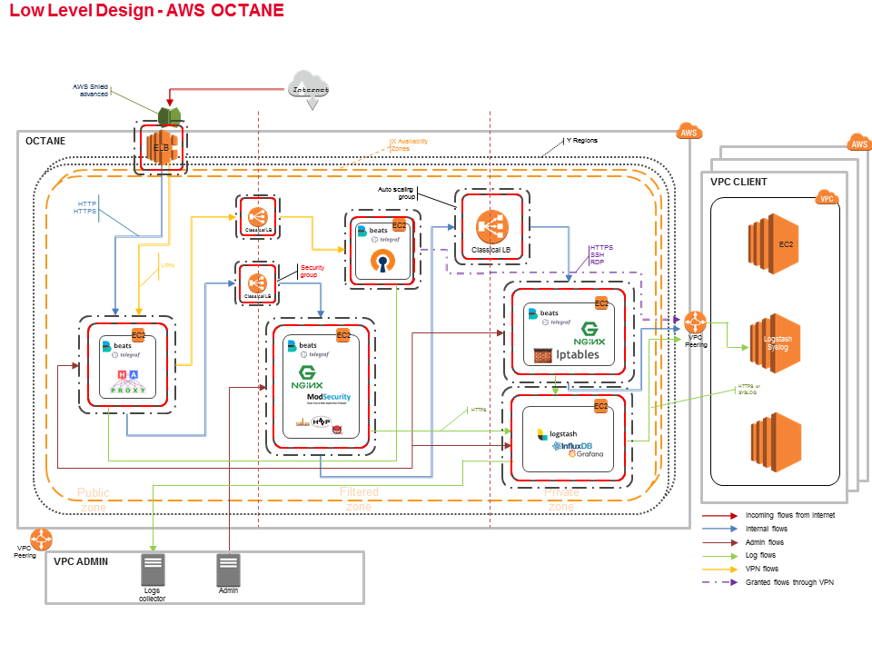
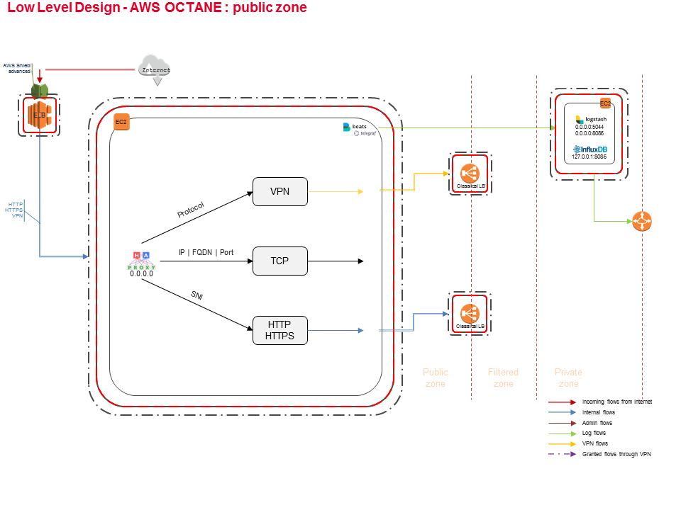
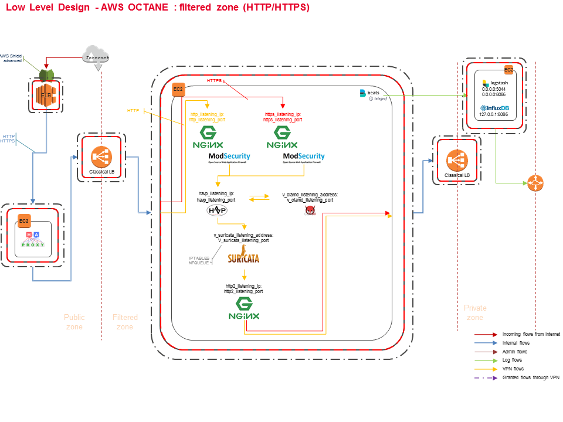
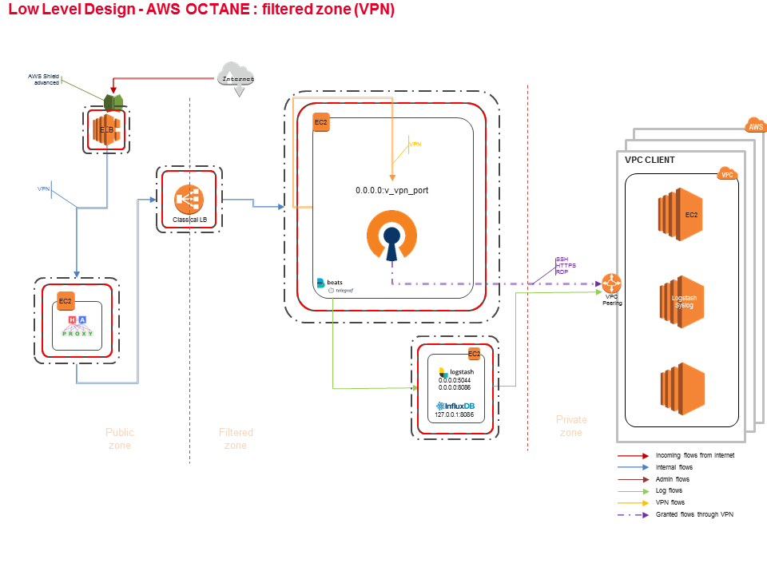
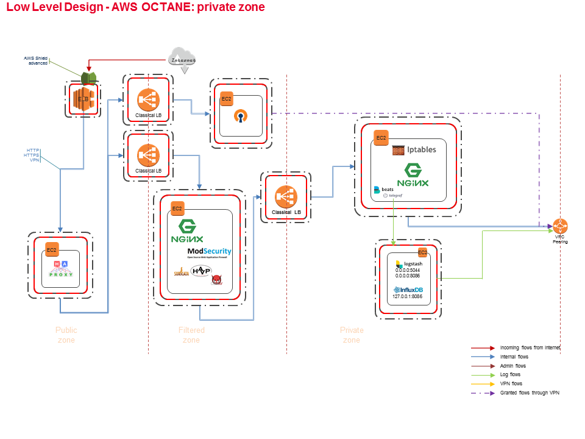
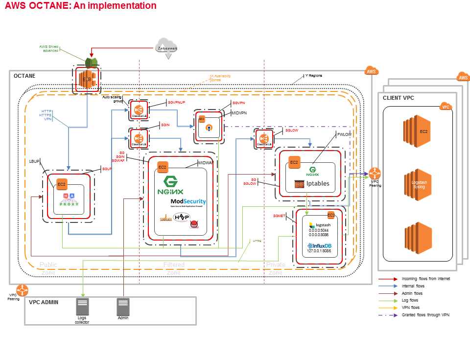

# AWS cIAP OCTANE 

## Presentation

This section is the detailled architecture (low-level design)

### Low level design

### Low level design: Public zone

### Low level design: Filtered zone

### Low level design: Filtered VPN zone

### Low level design: Private zone

### An implementation

